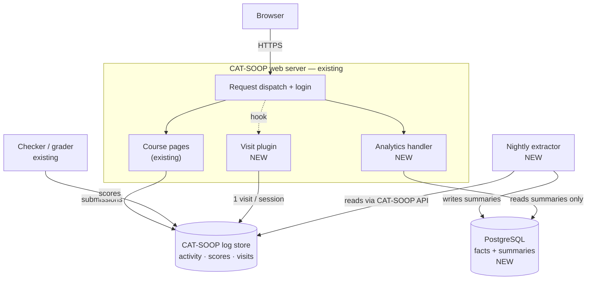
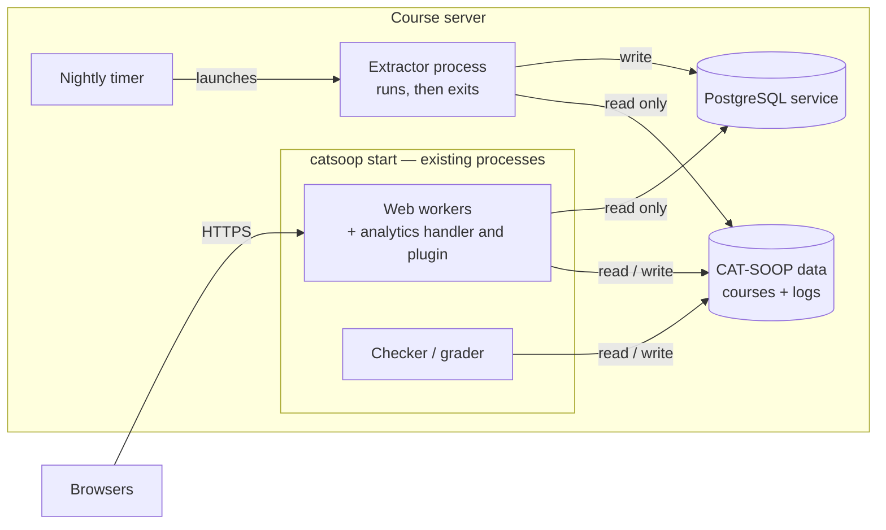
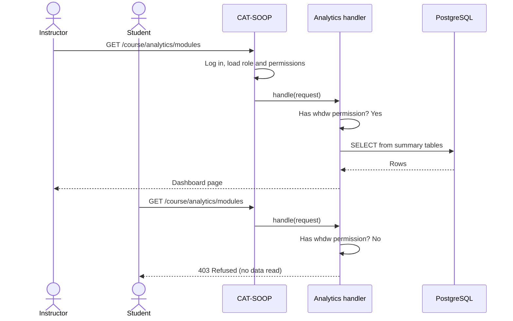
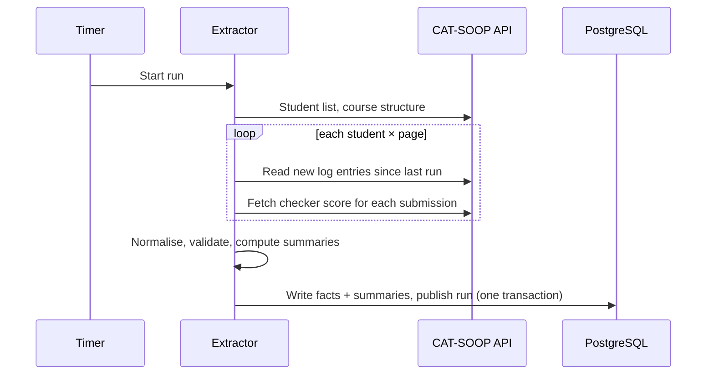
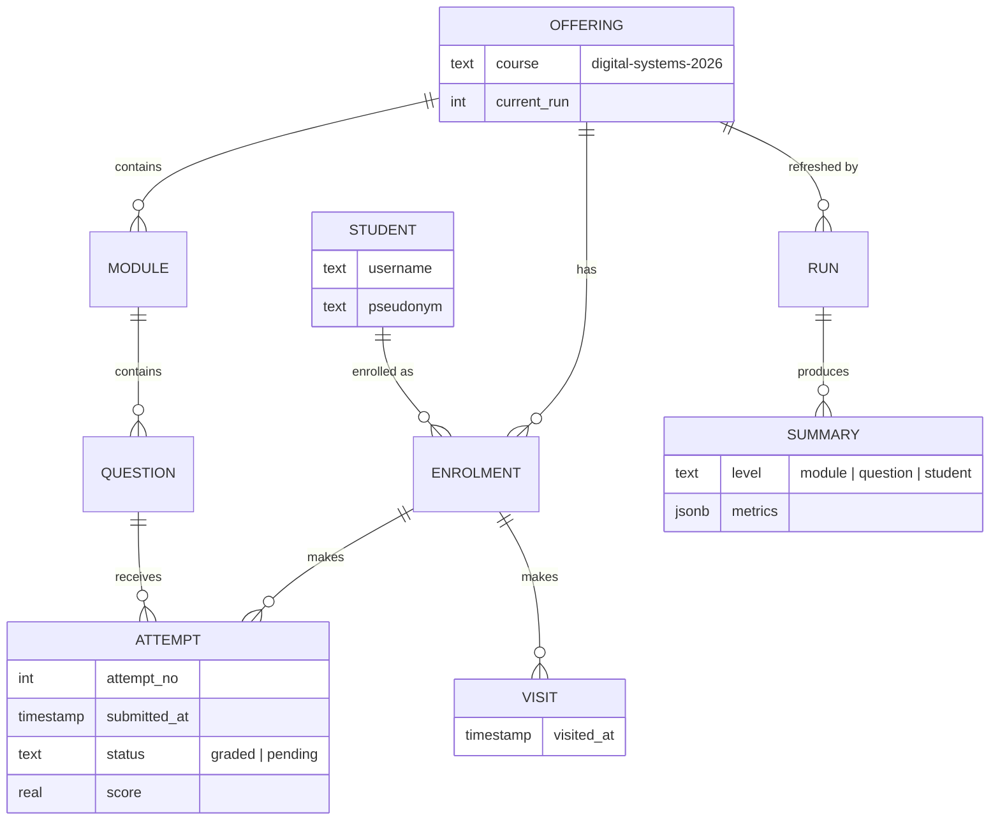
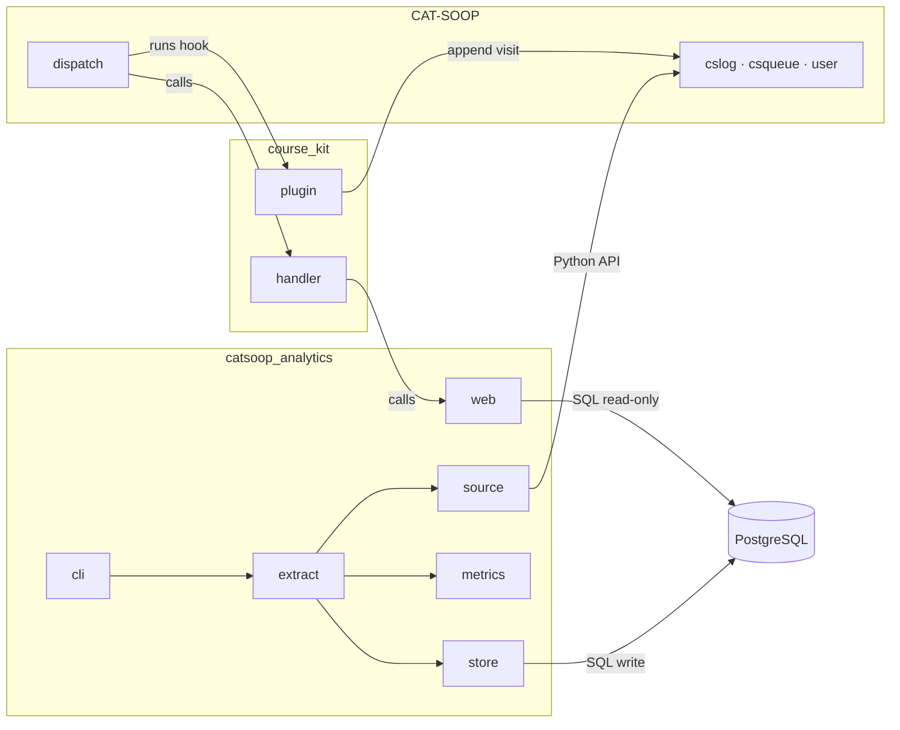

# CAT-SOOP Course Analytics — Architecture

**Course:** Software Tools and Techniques for CSE · IIT Gandhinagar
**Submission:** 2 — Architecture and design
**Builds on:** Project Plan (Submission 1)

---

## Summary

We add an instructor analytics dashboard to CAT-SOOP **without modifying CAT-SOOP's code**. A nightly Python job reads student activity through CAT-SOOP's own functions, computes summaries and stores them in PostgreSQL. The dashboard is a set of ordinary CAT-SOOP course pages that read only those summaries. CAT-SOOP's own login and permission system decides who can see them.

The design rests on one rule: **heavy work happens offline; pages only read precomputed results.** That rule is what keeps the live course safe for students.

---

## 1. Architecture and design decisions

### Overview

The system has two halves that share only a database:

- **Batch pipeline (offline):** extract → normalise → validate → load → compute summaries. It runs nightly from a scheduled job.
- **Dashboard (inside CAT-SOOP):** course pages, a course handler and a small plugin. They are served by CAT-SOOP's existing web processes.

CAT-SOOP remains the source of truth. If the analytics database were deleted, re-running the job would rebuild it.

### Key design decisions

| # | Decision | Why | Rejected alternative |
|---|---|---|---|
| D1 | Build the dashboard **as CAT-SOOP course pages**, not a separate web app | Login, roles, per-course permissions and site styling come for free | FastAPI + React (plan v1.0): needs its own login and a second copy of "who is staff" |
| D2 | **Compute offline, display precomputed summaries** | Pages stay fast at any class size and never compete with student submissions | Computing on page load: CAT-SOOP's existing staff views already do this and are slow at 250 students |
| D3 | Read CAT-SOOP data **only through its Python API** (`cslog`, `csqueue`, `user`), in one adapter module | Logs are pickled, can be encrypted, and may live in files, MongoDB or Firestore | Parsing log files directly: breaks under encryption or other storage backends |
| D4 | Record page visits with a **course plugin on the `post_handle` hook**, once per student, page and session | Visits aren't logged today; this hook fires only for real page views | `post_render`: also fires on 404 and error pages |
| D5 | Protect every analytics page with **one inherited handler that checks permission first** | `preload.py` runs before login, so it cannot check permissions itself | Hiding the menu link: not security |
| D6 | Gate access on CAT-SOOP's existing **`whdw` permission** (configurable) | No separate staff list that could drift out of sync | Hard-coding role names |
| D7 | **PostgreSQL**, with a read-only database role for the web pages | That role can only read summary tables, a second barrier behind D5 | SQLite: no per-role privileges |
| D8 | **Incremental, idempotent** extraction (per-log watermarks + upserts) | Nightly cost grows with new activity, not total history; re-runs are safe | Full re-scan every night |
| D9 | **Rule-based** attention flags, each with its stated reason | Explainable; there is no labelled data to train a model | Machine-learning risk score |
| D10 | **Discard answer text** during extraction; hide groups under 5 students | Metrics don't need the answers; minimises privacy risk | Storing full activity records |

### Tools and frameworks

| Area | Choice |
|---|---|
| Language | Python 3.10+ (required: CAT-SOOP data is only readable from Python) |
| Host platform | CAT-SOOP (this fork, pinned commit): plugins, course handlers, templates |
| Database | PostgreSQL 16 via `psycopg` 3 |
| Front end | Server-rendered HTML, vanilla JS, Chart.js 4 (bundled locally, no CDN) |
| Scheduling | systemd timer or cron, nightly |
| Testing | pytest, a synthetic persona course, Locust for load tests |
| Quality and CI | ruff, import-linter (enforces module boundaries), GitHub Actions |

---

## 2. Requirements the architecture focuses on

### Functional

| ID | Requirement |
|---|---|
| F1 | Course overview: students, active students, average score, completion per module |
| F2 | Module progress that separates **opened**, **started** and **completed** |
| F3 | Question analytics: first-attempt success, attempts to succeed, abandonment |
| F4 | Individual student progress compared with the class |
| F5 | Attention list with reasons; difficulty and flawed-question detection |
| F6 | Staff-only access; role-based landing pages for guest, student and staff |
| F7 | Nightly, incremental data sync; multi-course and multi-semester support |

### Quality attributes

| Attribute | Target |
|---|---|
| **Performance** | Any dashboard page responds in < 300 ms at 5,000 students; the visit hook adds < 5 ms |
| **Non-interference** | Student submissions are unaffected by dashboard use or by extraction |
| **Security** | Students and guests are refused on every URL, including data endpoints; permission is per course |
| **Privacy** | No answer text stored; no statistic shown for groups under 5 |
| **Correctness** | Attempt counts match CAT-SOOP's own counts exactly; ungraded ≠ zero |
| **Reliability** | Analytics failures never affect the course; the last good data stays visible |
| **Maintainability** | Zero changes to `catsoop/`; CAT-SOOP-specific code lives in one module |
| **Extensibility** | A new page or course is added by adding a folder, not by changing existing code |

### Constraints

- CAT-SOOP's source must not be modified.
- Data can only be read with Python, through CAT-SOOP's own modules.
- The dashboard runs inside CAT-SOOP's web processes: no separate server, no frontend build step.

---

## 3. Overall system structure

### Components and how they interact



### Run-time processes



| Process | Started by | Role |
|---|---|---|
| CAT-SOOP web workers | `catsoop start` | Serve course **and** analytics pages; our handler and plugin run inside them |
| Checker / grader | `catsoop start` | Grades submissions in the background (existing) |
| Extractor | Nightly timer | Reads logs, computes summaries, exits |
| PostgreSQL | System service | Stores analytics data |

The extractor writes each run in **one transaction** and publishes it atomically, so pages never see half-updated numbers. A database lock prevents two runs from overlapping.

### Interfaces

| Interface | Used by | Contract |
|---|---|---|
| Dashboard pages | Instructor's browser | `GET /<course>/analytics` plus `/modules`, `/questions`, `/students`, `/student?u=<pseudonym>`, `/attention` → HTML page |
| Data endpoints | Dashboard JavaScript | Same URLs with `?format=json&sort=&page=` → `{"as_of": "<ISO time>", "rows": [...], "next": <page>}`; `?format=csv` for export |
| Course handler | CAT-SOOP dispatch | `handle(context) -> str` (page) or `(status, headers, body)` (JSON, CSV, 403) |
| Plugin hooks | CAT-SOOP dispatch | `post_handle.py` (record visit) and `post_auth.py` (staff menu link), run with the request context: `cs_user_info`, `cs_path_info`, `cs_session_data` |
| CAT-SOOP API | Extractor, plugin | `cslog.read_log(user, path, log)`, `cslog.update_log(user, path, log, entry)`, `csqueue.get_results(job_id)`, `user.list_all_users(context, course)` |
| Visit log entry | Plugin → extractor | `{"t": "<timestamp>", "sid_h": "<hashed session id>"}` in log `analytics_visits` |
| Command line | Timer, operators | `catsoop-analytics extract --course C [--full]` · `rebuild` · `verify` · `migrate` — exit code + JSON run report |
| Database | Extractor, handler | Writer role: all tables. Reader role: `SELECT` on summary tables only |

### Instructor opens the dashboard; a student tries the same URL



### Nightly extraction



### Data structures

**What CAT-SOOP already stores (input):**

| Log | Contains | Used for |
|---|---|---|
| `problemactions` | Every submit / check / save, with timestamp and grader job id | Attempt history |
| Checker results | Score for each grader job | Attempt scores |
| `problemstate` | Current state only (overwritten each time) | Cross-checking counts |
| `__USERS__/*.py` | Each user's role and section | Roster |
| `analytics_visits` *(new)* | One entry per student, page and session | "Opened a module" |

**Analytics database (output):**



*Facts* (attempts, visits) can always be rebuilt from CAT-SOOP. *Summaries* are tied to a run, so pages always read one consistent snapshot.

---

## 4. Major code modules and how they communicate

### Layout

```
catsoop/                      unchanged
analytics/
├── catsoop_analytics/        installable Python package
│   ├── source/               the only code that imports catsoop
│   ├── extract/              normalise, validate, run orchestration
│   ├── metrics/              progress, difficulty, attention (pure functions)
│   ├── store/                database access and migrations
│   ├── web/                  access check, read-only queries, page rendering
│   └── cli.py                extract · rebuild · verify · migrate
└── course_kit/               copied into each course folder
    ├── __PLUGINS__/analytics/     visit capture, staff menu link
    ├── __HANDLERS__/analytics/    permission check → web package
    └── analytics/                 dashboard pages + static JS/CSS
```

### Module interaction



| From → To | Communication |
|---|---|
| CAT-SOOP → plugin, handler | In-process calls at defined extension points |
| Plugin → CAT-SOOP log store | `cslog.update_log` (one append) |
| Handler → `web` | Python function call |
| `web` → PostgreSQL | SQL `SELECT` on summary tables, read-only role |
| Browser → handler | HTTPS; `?format=json` for chart data |
| `extract` → `source` → CAT-SOOP | Python calls returning plain dataclasses |
| `extract` → `metrics` → `store` | Function calls; one SQL transaction per run |

**Boundaries enforced in CI:** only `source` imports CAT-SOOP; `metrics` has no I/O; `web` can only read.

### What each module provides

| Module | Main functions | Returns |
|---|---|---|
| `source` | `students(course)`, `modules(course)`, `log_entries(user, page, log)`, `checker_score(job_id)` | Plain dataclasses; answer text already removed |
| `extract` | `run(course, full=False)`, `to_events(raw_entries)`, `validate(events)` | Attempts, visits, anomalies, run report |
| `metrics` | `progress(facts)`, `difficulty(facts)`, `attention(facts, rules)` | Summary rows (pure functions, no I/O) |
| `store` | `begin_run()`, `upsert_facts()`, `write_summaries(run)`, `publish(run)`, `reader()` | Database transactions and connections |
| `web` | `require_staff(context)`, `route(context)`, `overview()`, `modules()`, `questions()`, `student()`, `attention()` | HTML fragments or JSON |
| `cli` | `extract`, `rebuild`, `verify`, `migrate` | Exit code + run report |

---

## 5. How the design satisfies the requirements

### Functional requirements

| ID | Delivered by | Decisions |
|---|---|---|
| F1 | `metrics.progress` computes module and course summaries; the Overview page reads them | D2 |
| F2 | The visit plugin supplies *opened*; attempts supply *started* and *completed*; `metrics.progress` keeps all three separate | D4, D8 |
| F3 | Attempt history joined with checker scores in `extract`; `metrics.difficulty` computes success rates and abandonment | D3, D8 |
| F4 | Student summaries, shown at `/analytics/student?u=<pseudonym>` next to class averages | D2, D10 |
| F5 | `metrics.attention` rule functions with stated reasons; ability bands and flawed-question check in `metrics.difficulty` | D9 |
| F6 | Inherited analytics handler checks `whdw`; course home page shows different content per role | D1, D5, D6 |
| F7 | Nightly timer and watermarks; all data keyed by course offering; each course gets its own copy of `course_kit` | D8 |

### Quality attributes

| Requirement | How the structure and decisions satisfy it |
|---|---|
| **Performance** | Pages read small precomputed tables with indexed, paginated queries (D2); the visit hook is one append per session (D4) |
| **Non-interference** | Heavy reading runs in a separate process at night (D2); CAT-SOOP never depends on the analytics database |
| **Security** | CAT-SOOP authenticates first; one inherited handler checks permission before any data access (D5, D6); the database role blocks raw data (D7) |
| **Per-course access** | Permissions come from each course's own user files, so staff on one course get nothing on another (D1) |
| **Privacy** | Answer text is dropped in the adapter; small groups are suppressed before any page or export sees them (D10) |
| **Correctness** | Attempt = `submit` only; ungraded submissions stay *pending*; a `verify` command diffs our counts against CAT-SOOP's |
| **Reliability** | Atomic publication keeps the last good run visible; failed runs roll back and retry safely (D8) |
| **Maintainability** | Only CAT-SOOP extension points are used; all CAT-SOOP-specific code is in `source/` (D3) |
| **Extensibility** | New page = new folder, automatically protected (D5); new course = copy `course_kit/`; new rule = one function (D9) |
| **Scalability** | Incremental runs scale with new activity (D8); all data is partitioned by course offering |

### Trade-offs we accept

- **Data is up to a day old.** Each page shows when its data was last refreshed; runs can go hourly if needed.
- **No modern front-end framework.** Server-rendered tables and a small charting library are enough, and match the platform.
- **We rely on internal CAT-SOOP functions.** They are isolated in one module and covered by contract tests.

---

## Appendix: What the CAT-SOOP source confirmed

We read the source before designing. These findings drive the decisions above and correct parts of Submission 1.

| Finding | Where | Decision |
|---|---|---|
| Every submit/check/save is appended to `problemactions`; scores for auto-graded questions arrive later from the checker | `default.py` `log_action`, `grader.py` | D3, D8 |
| Page views are not logged; AJAX actions return before `post_handle`, but error pages still trigger `post_render` | `dispatch.py` L422, L876 | D4 |
| `preload.py` runs **before** login; courses can supply their own handler, which runs after | `loader.py`, `tutor.py` `handler()` | D5 |
| `whdw` is CAT-SOOP's existing staff-monitoring permission | Course `preload.py`, `default.py` | D6 |
| The log store can be files, MongoDB or Firestore, optionally encrypted | `cslog.py` `initialize()` | D3 |
| URLs map to folders, so `/students/<id>` would 404; use `/student?u=<id>` | `dispatch.py` `is_resource` | Routes |
| Staff "view as student" actions are logged under the student's name | `auth.py` | Excluded from metrics |
